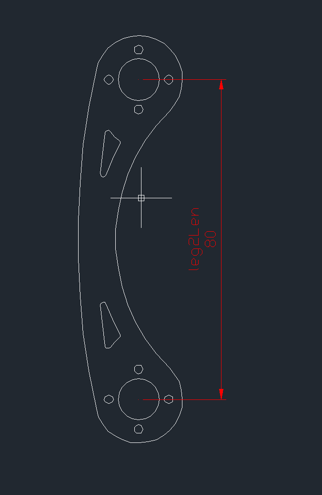
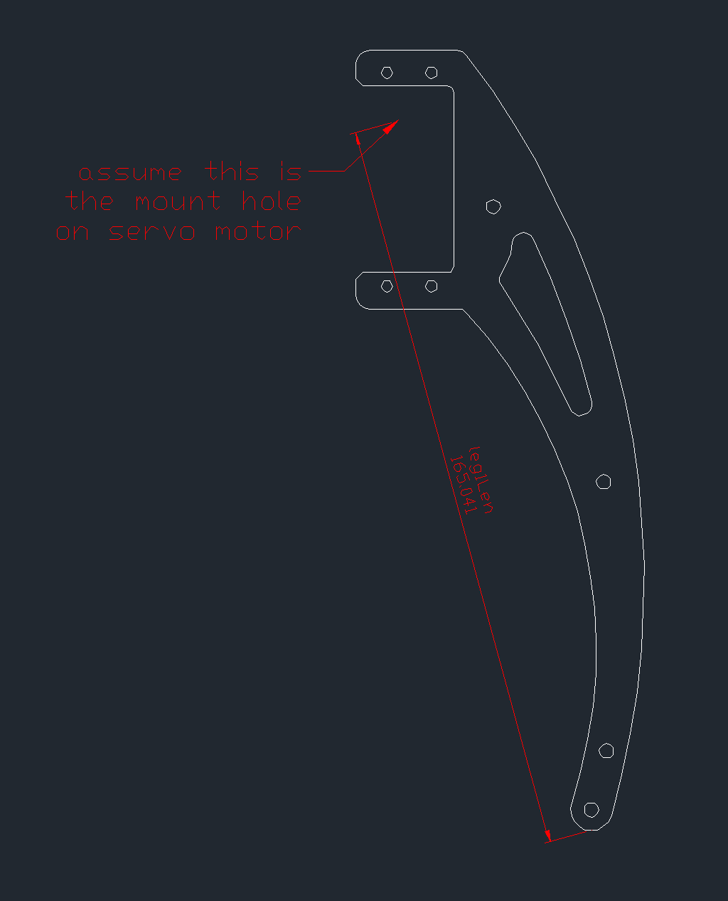
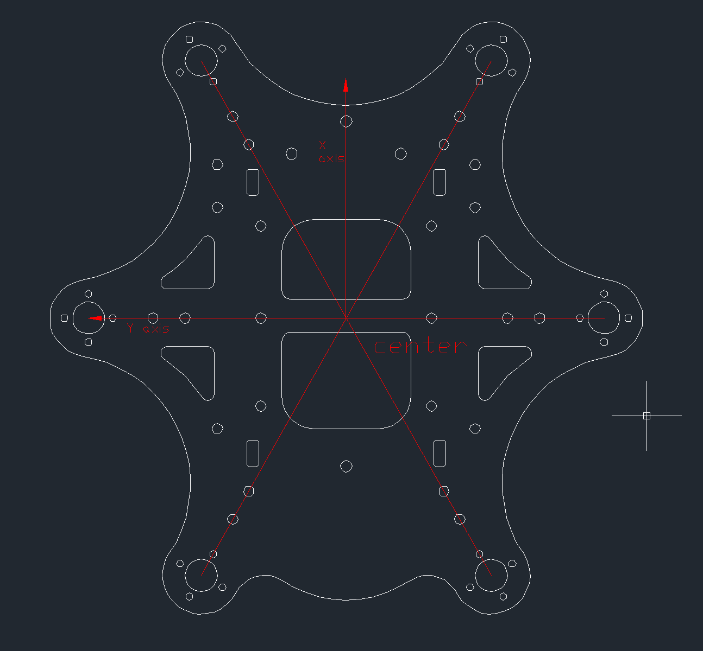

# Corexapod
A hexapod robot engine developed by STC Dev Team.
Can be adapted to any common hexapod by just editing a few lines of configuration file.

# Prerequsites
* Eigen
	http://eigen.tuxfamily.org
* Boost
	http://boost.org
* wiringPi(optional, for operations on Raspberry Pi only)
	http://wiringpi.com/download-and-install/
* distcc(optional, for faster compilation speed on RPi)
	https://code.google.com/p/distcc/

# Build
	mkdir build
	cd build
	cmake ..
	make
	
# Running & Testing
	bin/cdm (Daemon)
	python backend.py xxx.xxx.xxx.xxx (Web Interface)

# Configuration
Here we provide you an example of configuration file for our robot. Please feel free to edit this file. Please note the file is in boost's info format.
Basically we have two ways to generate this file:
1. We provide you an calibration method which can generate the full file for you.
2. Directly edit the .info file.
A little explanation for the info file:
We have four parts in this file:
1.Length

In our model, we mainly need four length constants

2.Origin of each 'leg' with reference to 'center' of the robot.

3.Position of each leg's foot.

4.Servo configuration

minPW: pulse width for 0 deg of the servo motor

maxPW: pulse width for 180 deg of the servo motor

number: currently we are using torobot's usc-32 servo control board, so this is the channel of the servo

5.Servo Association with leg

We have 3DOF for each leg, so in this section we need to specify which servo a leg is going to use.

